# Deploy an out of the box MeiliSearch in DigitalOcean

### Disclaimer

The current DigitalOcean image is not yet available in the marketplace.  
This steps are only addressed for MeiliSearch team (for now).  

# Create an out of the box MeiliSearch

### 1. Create a new droplet

In any DigitalOcean page, when you are logged in, you will find a menu in the upper-right corner. Click on Create -> Droplets

  

### 2. Select MeiliSearch snapshot

By default DigitalOcean will show you the "distributions" tab. Select the "Snapshots" tab and look for our own MeiliSearch Debian image

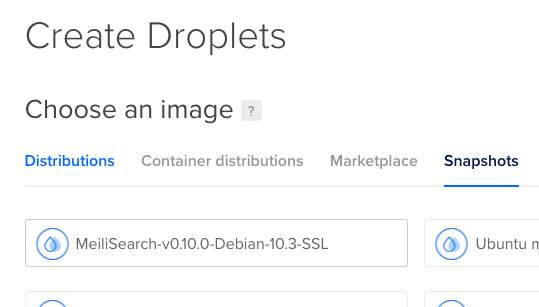  

### 3. Click on show all plans

By default, Digital Ocean propose plans that might be to expensive for our testing purposes. If you want to select the cheapest plan for testing, click on "show all plans" (bottom-right corner)

  

### 4. Select your plan

Select the cheapest plan by clicking on it

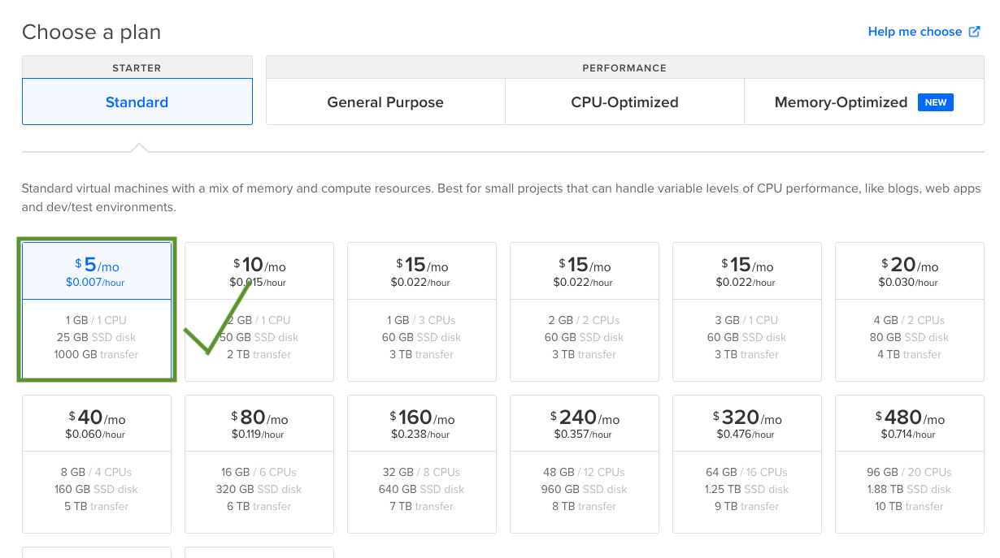  

### 5. Select a region for your droplet

Select the region where you want to deploy your droplet. Remember, closer is faster, but prices can change significantly. We will choose London for this example, but it works anywhere

  

### 6. Add your ssh key

Select your SSH key in order to be able to connect to your droplet later. If you don't see your SSH key add yours to your account.  

If you need help with this, visit [this link](https://www.digitalocean.com/docs/droplets/how-to/add-ssh-keys/to-account/)

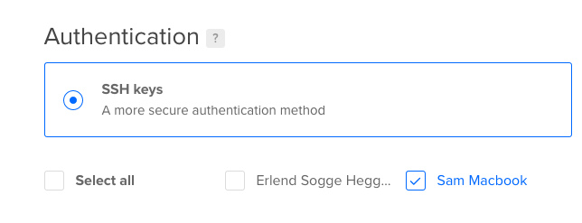  

### 7. Type your droplet name

Here you can select the name that will be visible everywhere in DigitalOcean account. Choose wisely!

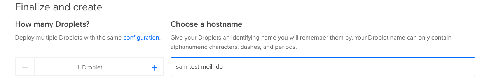  

### 8. Add tags

Tags are a very good method to know who created ressources, and for organizing or cleaning purposes. Try to always add some tags so other people can know who uses the machine, and for what purposes.

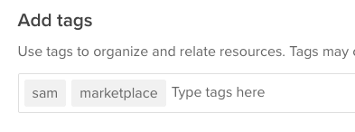  

### 9. Finally click on Create Droplet

  

### 10. Your MeiliSearch is running (with no config).  

 While creating...  

 

When it's done...  

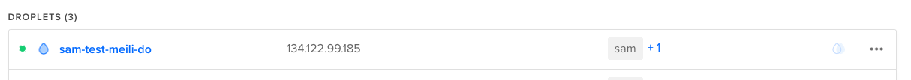 

### 11. Test MeiliSearch.

Copy the public IP address

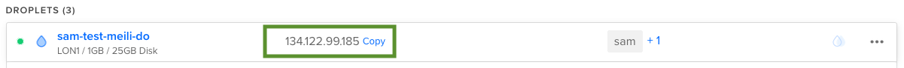  

Paste it in your browser. If this screen is shown, your MeiliSearch is now ready!

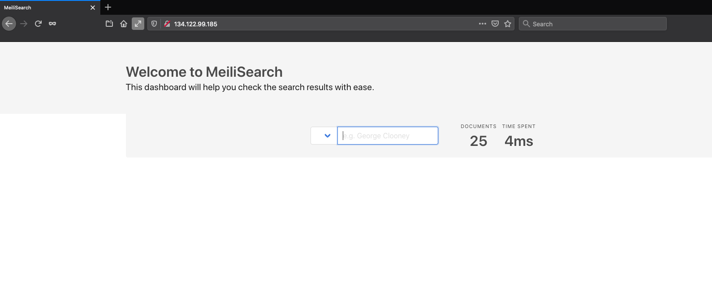  

# Configure settings in your MeiliSearch Droplet

Configuring your MeiliSearch from a DigitalOcean droplet is very straigth-forward. Establish an SSH connexion with your droplet and a script will guide you through the process.

### 12. Make your domain name point to your droplet

If you want to use your own domnain name (or sub-domain), add an A record in your domain name provider account

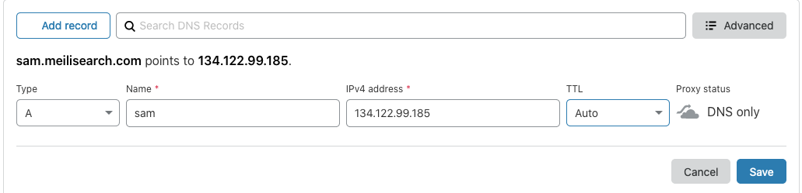  

This should work out of the box. Your domain should be usable for your MeiliSearch

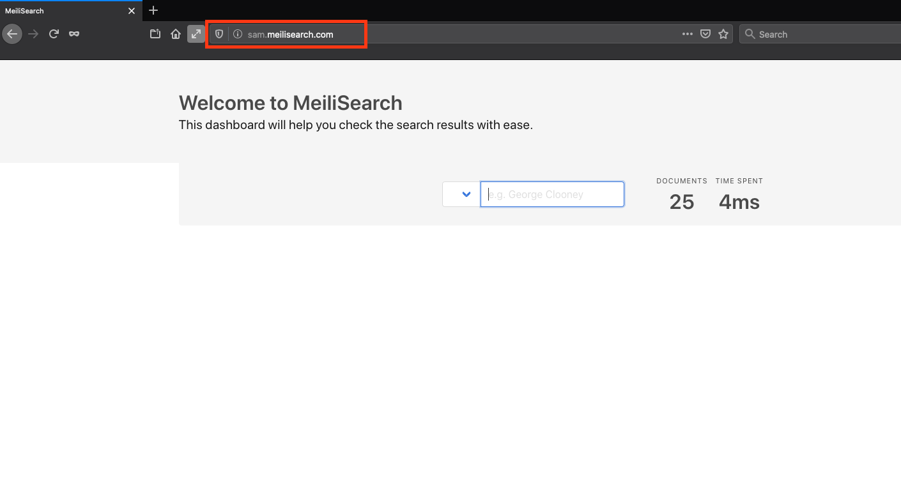  

### 13. Set API KEY and SSL (HTTPS)

Meilisearch is running out of the box. It means that you haven't set an API KEY (anyone can read/write from your MeiliSearch) and you can't use HTTPS. But no worries, the configuration process is automated and very simple. Just connect via SSH to your new MeiliSearch Droplet and answer a few questions:

### 13.1. Open a terminal

Open a terminal and start a new SSH connection with the IP you got from DigitalOcean  

Write in your terminal `ssh root@134.122.99.185`  and press Enter to establish connection 

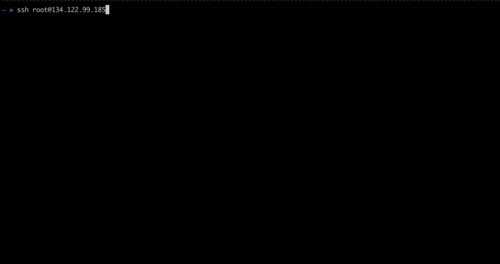  

Write `yes` and press Enter to accept the authentication process  

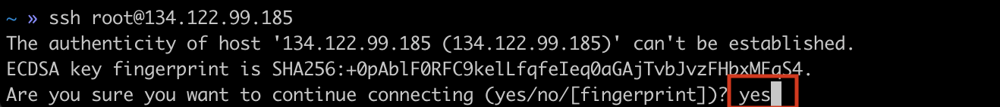  

A script will run automatically, asking for your settings. If you want to run this script anytime, you can run it again by typing:  

`sh /var/opt/meilisearch/scripts/first-login/001-first-login.sh`

### 14. Enjoy your ready to use MeiliSearch 

Enjoy!

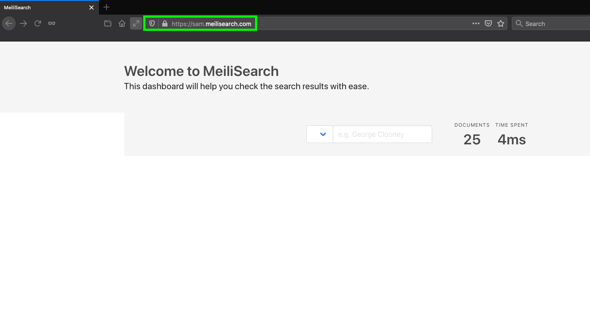  